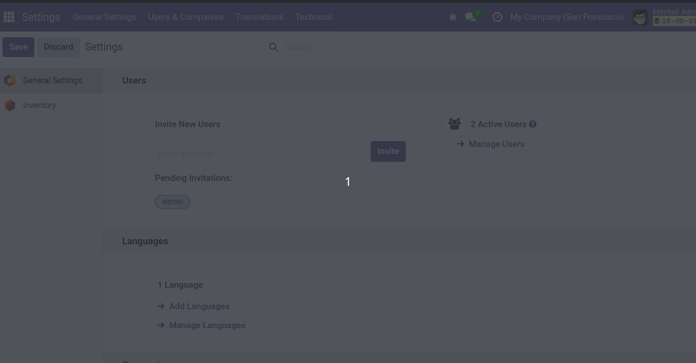
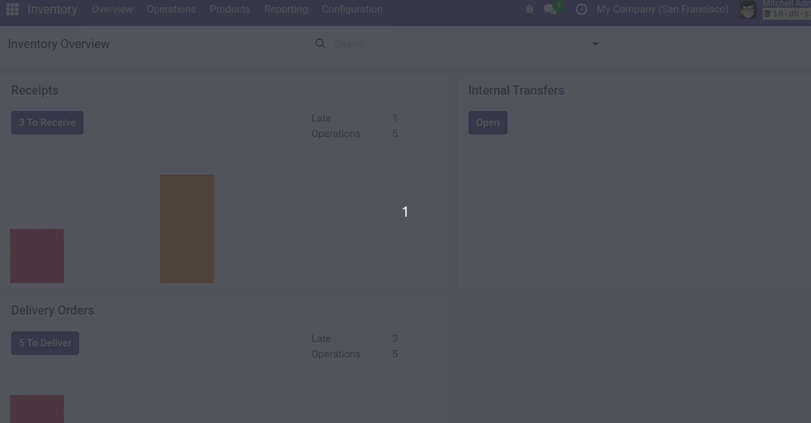

- Go to *Settings* and activate the developer mode.
- Go to *Settings \> Technical \> Resource \> Working Schedules* and define
  your Working Time.

- Go to *Inventory \> Configuration \> Warehouse Management \>
  Warehouses* and assign the Working Schedule.

- Go to *Inventory \> Configuration \> Settings* and in *Warehouse* mark
  'Multi-Step Routes option'.

- Go to *Inventory \> Configuration \> Warehouse Management \> Routes*
  and set up the proper delays in the stock rules where 'action' is
  'Pull and Push' or 'Pull'.

